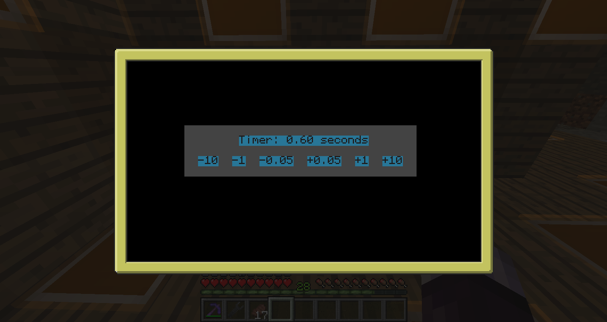

==CCRP: ComputerCraft Redpower Replacement

The goal of this project is to replace most redpower curcuits with Computercraft scripts. As of yet a Timer script is almost feature complete with a GUI and a general purpose circuit diagram script is in active development.

